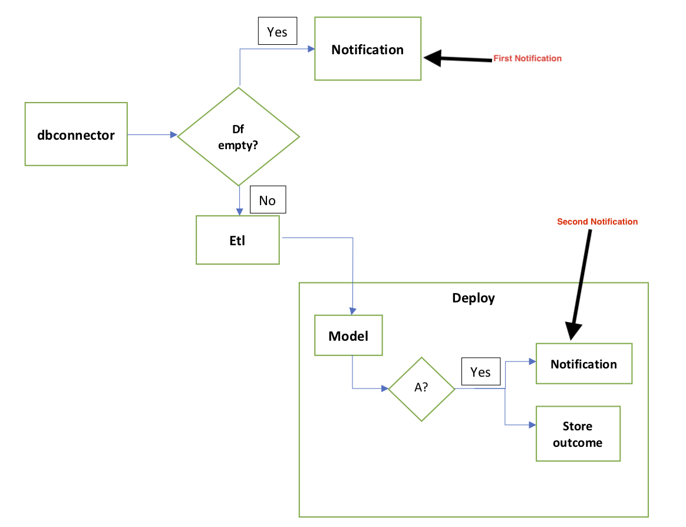

# Volume Based Anomaly Detection 

Volume Based Anomaly Detection is the kind of anomaly detection apply to volume of data. In this case,  it is applying to daily of volume based on features such as channelid, actioncode, os_family. The objectives of the anomaly include:

1. To detect  unusual daily volume of data such as:
    1. Too high volume i.e. that could be an indication of duplicate in the data.
    2. Too low volume i.e. that could be an indication that data is not processing  as it ought to be.
2. Other unusual volume based on the features selected Or if there not data for the day.

Since we do not know what anomaly is as per the systems (database tables) we would be investigating, we need to diverse a mean to estimate what anomaly could be in our daily volume. From the machine learning perspective, this problem is categorised as unsupervised.

### Isolation Forest  
The term isolation means ‘separating an instance from the rest of the instances’. Since anomalies are ‘few and different’ and therefore they are more susceptible to isolation. In a data-induced random tree, partitioning of instances are repeated recursively until all instances are isolated. This random partitioning produces noticeable shorter in a tree structure, and instances with distinguishable attribute-values are more likely to be separated in early partitioning. Hence, when a forest of random trees collectively produce shorter path lengths for some particular points, then they are highly likely to be anomalies.


### How IsolationForest is applied  
Implementing Isolation forest algorithm is straightforward in itself, selecting right values for the hyperparameters may be try and errors sort of thing. I implement the algorithm with scikit-learn package in Python. Let’s see how it works. The common hyperparmaters are discussed below: 

n_estimators: The number of trees to use. The research paper suggests an number of 100 trees, because the path lengths usually converges well before that.
max_samples: The number of samples to draw while build a single tree. This parameter is called sub-sampling in the paper. They suggest max_samples=256, since it generally provides enough details to perform anomaly detection across a wide range of data.
contamination: The amount of contamination of the data set, i.e. the proportion of outliers in the data set. Used when fitting to define the threshold on the decision function. I will show how to pick this threshold later.

### Training and  Deployment Structure  
Schema diagram of the project is below: This is applied to activityhistory:


|-- data/

|-- dbconnector.py

|–- etl.py

|-- train.py

|–- mlruns/

|-- Resultsir/

|-- logfile.py

|-- notofication.py

|–- deploy.py

Fig 1.


### Data processing and ETL
1. Sql query or data source is fed into dbconnector.py which produces dataframe.
2.  The dataframe especially column os_family which is a user-agent needs to be cleaned to produce OS family only. The dataframe needs to be regrouped sum columns "count" by date, channelid, actioncode and  os_family.

3. The date column in the dataframe is converted to the index. The index is used to generate two new columns weekday and month. The weekday and month allows us to understand the seasonality in the dataset.

4. Since channelid and os_family are text datatype, we apply labelencoding technique to map them to numbers that the machine learning algorithms could consume. 

5. Finally, the dataframe needs to be scaled by standard the dataset across.

### Model Training and Structure using MLFlow
The training dataset is a year dataset with daily volume.
Feed the dataset through etl (refer to data processing etl session) to produce dataframe
 Use dataframe to train a model through IsolationForest algorithms:
To be able to prototype and train the model many times and still keep tracking of the models, I use MLFlow to do this.
As mention above, the first hyperParameters user are : 
param_100_tree = {
       "behaviour":'new',
      "n_estimators":100, 
     "max_samples":256, 
     "contamination":0.15, 
"random_state":2019
}

We assumed a contamination of 20% in the dataset. The result look like this:


The histogram chart above represents distribution of decision function score.  The decision function of the isolation forest provides a score that is derived from the the average path lengths of the samples in the model. We can use this to decide which samples are anomalies. Basically, the cluster under -0.15 would be considered as anomaly. In this case, the cluster is insignificant. 

#### Illustration:

The red arrow points to small heap which represents anomaly. If the heap touches or surpasses the threshold line then anomaly is significant and notification should trigger.

The black line represents threshold to use to determine anomaly. It could be if anomaly heap goes up to 10% or 20% of the histogram frequency, we would call there is an anomaly in the dataset.

The green line represents percentage of contamination, in this  case, it is  -15%. Anything at right side of green line represents anomaly and left is normal.

### Model deployment using Cron
We might have trained 10 or more models. Mlflow has been set up within train.py to help with tracking the models and their metrics. From terminal, we could use mlflow ui and paste http://localhost:5000 into browser to see how models have been tracking.
Or python mlflow api could be used instead of cli:

 experiment_id='0'

from mlflow.tracking import MlflowClient

      client = MlflowClient()

      for run in client.list_run_infos(experiment_id):

                         print(run)

This will provide you with list of all your runs then you can pick the model you think has best performance.

2.  in the deploy.py module, all other modules have to be called except train.py

fig4:




```python

```
